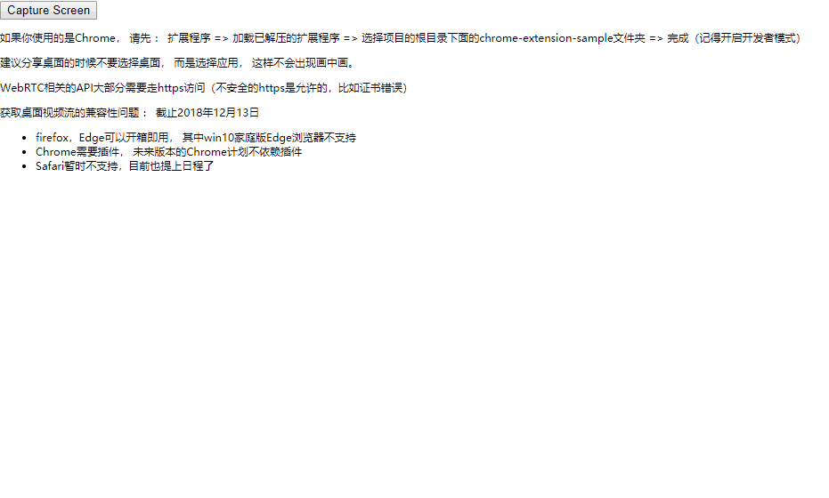

<h1 align="center"></h1>
# screen-capture-demo

> 一个非常简单的获取桌面视频流的demo

## 依赖库
* webrtc-adapter  使用webrtc api墙裂推荐的兼容性垫片库
* getscreenmedia  非常小，只有90行代码

## 快速开始

```text
# install dependencies
npm install

# serve with hot reload at localhost:8080
npm run dev
```

Tip：
```text
如果你使用的是Chrome， 请先 ： 扩展程序 => 加载已解压的扩展程序 => 选择项目的根目录下面的chrome-extension-sample文件夹 => 完成（记得开启开发者模式）

建议分享桌面的时候不要选择桌面， 而是选择应用， 这样不会出现画中画。

WebRTC相关的API大部分需要走https访问（不安全的https是允许的，比如证书错误）

获取桌面视频流的兼容性问题 ： 截止2018年12月13日

firefox，Edge可以开箱即用， 其中win10家庭版Edge浏览器不支持
Chrome需要插件， 未来版本的Chrome计划不依赖插件
Safari暂时不支持，目前也提上日程了

```
